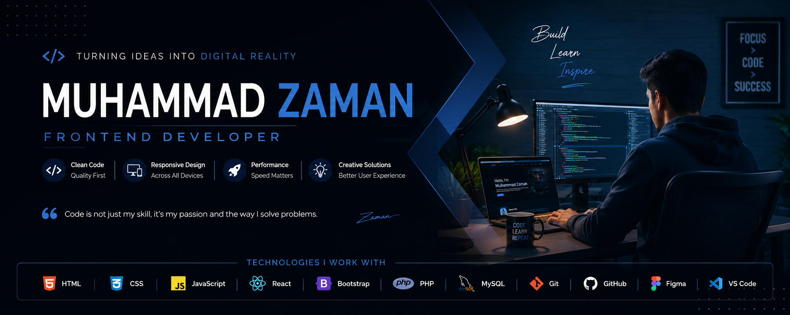

  

# 👋 Hi, I'm Muhammad Zaman

### 💻 Frontend Developer | Web Developer | Creative Problem Solver

  
  

---

## 🚀 About Me

  

 

  

 

### 🔮 **About Me**

<table>
<tr>
<td>

I'm a passionate **Frontend Developer** who transforms ideas and designs into **modern**, **responsive**, and **user-friendly** websites. I thrive on learning new technologies, building real-world projects, solving problems, and continuously improving my development skills.

</td>
</tr>
</table>

 

### ⚡ **Current Status**

<table>
<tr>
<td width="50%">

#### 🔭 **Currently Working On**

---

## 🛠️ Tech Stack

### 🌐 Frontend

  

### ⚙️ Backend & Database

  

### 🧰 Tools & Platforms

  

---
## 📌 Featured Projects

### 🎓 Future Genius Academy Management System

  
  

> A comprehensive web-based academy management system streamlining student enrollment, fee tracking, and academic performance monitoring.

**🔧 Tech Stack:**

  

**✨ Key Features:**
- 📊 Student enrollment & batch management
- 💰 Fee collection & payment tracking
- 📈 Academic performance analytics
- 👨‍🏫 Teacher & staff management

  
  

---

### 📚 E-Library

  
  

> An intelligent online library platform empowering university students with seamless access to educational resources and course materials.

**🔧 Tech Stack:**

  

**✨ Key Features:**
- 📖 Digital resource catalog & search
- 🔍 Advanced search & filtering
- 📱 Responsive design
- 📚 Course material organization

  
  

---

### 💼 Personal Portfolio

  
  

> A modern, responsive developer portfolio showcasing my projects, skills, and professional development journey with a sleek UI.

**🔧 Tech Stack:**

  

**✨ Key Features:**
- 🎨 Modern & responsive design
- ⚡ Interactive UI components
- 📱 Mobile-first approach
- 🚀 Optimized performance

  
  

## 📈 GitHub Activity Graph

  

## 🔥 Contribution Streak

  

---
## 📈 My Development Journey

  
### 🚀 Frontend Development
| Technology | Level | Progress |
|------------|-------|----------|
|  **HTML & CSS** | ●●●●● | 100% |
|  **JavaScript** | ●●●●● | 80% |
|  **React** | ●●●●● | 60% |

### 💾 Backend Development
| Technology | Level | Progress |
|------------|-------|----------|
|  **PHP & MySQL** | ●●●●● | 75% |
|  **Node.js** | ●●●●● | 40% |
|  **MongoDB** | ●●●●● | 35% |

## 🐍 Contribution Snake

  

